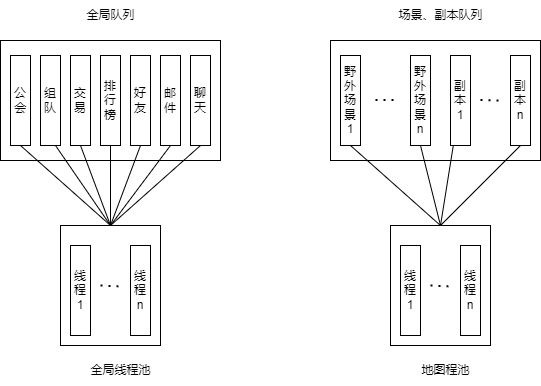
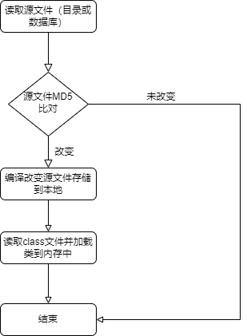
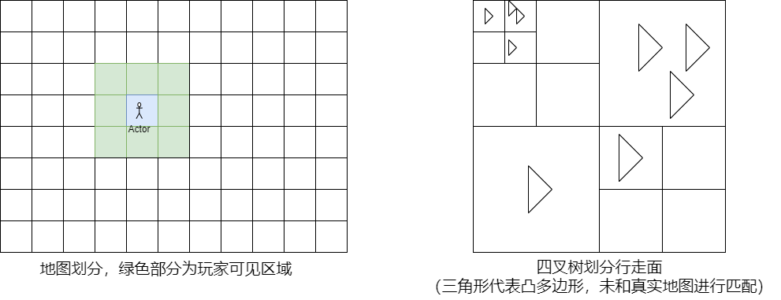
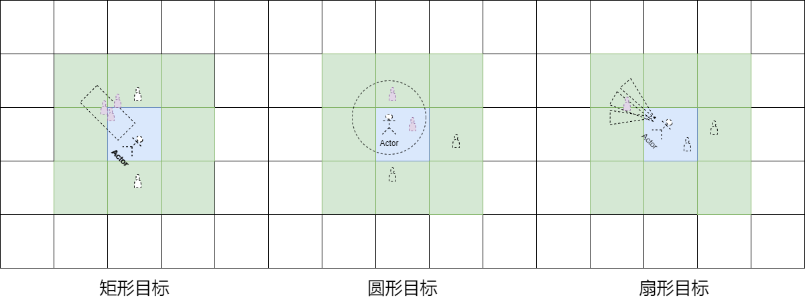

# 核心模块
&emsp;&emsp;此小节主要介绍MMORPG游戏中的关键技术、特性及注意事项，主要模块有：
* 线程模型
* 热更新
* 地图战斗


## 线程模型
&emsp;&emsp;因为服务器采用的是多进程多线程模型，因此线程模型未设计好，经常会出现各种bug和性能问题。
经过多次实践借鉴最终基于netty的线程模型进行了封装，源码可参考[javaLib](https://github.com/jzyong/javalib/tree/main/javalib-network/src/main/java/com/jzy/javalib/network/scene) 。
采用n个线程对应m个队列，一个线程可绑定多个队列，一个队列可以是一个功能模块，比如公会可分配一个队列绑定到唯一的线程，如下图所示：  



```
//场景线程组
SceneLoopGroup sceneLoopGroup = new SceneTaskLoopGroup();
//全局线程组
SceneLoopGroup soleLoopGroup = new SceneTaskLoopGroup();

//注册
SceneLoop sceneLoop = soleLoopGroup.next();

//teamScene 是实现了Scene接口的TeamManager单例对象
teamScene.register(sceneLoop);
guildScene.register(sceneLoop);
...
```
&emsp;&emsp;上面示例代码`SceneTaskLoopGroup`等价于Netty的`NioEventLoopGroup`,`Scene`等价于Netty的`Channel`。
全局所有玩家操作的对象如公会，聊天，组队等都单独创建一个独立的队列，所有玩家该功能模块的操作都丢人该队列中执行；
野外场景，副本的创建也单独创建一个队列，在同一场景、副本的玩家操作在同一队列中执行。

## 热更新
&emsp;&emsp;热更新使用Java自带的`JavaCompiler`将源文件编译成class文件，然后使用`ClassLoader`将class文件加载到内存中，
源码及示例可参考[GameServer4j](https://github.com/jzyong/GameServer4j) 。
此方法优点是使用java原生代码，开发简单方便;缺点是只能更新部分逻辑，如数据存储实体类不能进行热更新，逻辑必须实现接口。
大致流程如下：  



## 地图战斗
### 地图设计
1. 地图分为野外地图、副本、战场、公会地图等，其中野外地图又按人数分多线。
2. 每个地图都绑定一个消息队列，同一地图的玩家操作，战斗都在同一线程执行。
3. 每个地图都有定时器进行AI、技能的定时计算。
4. 地图划分主要有两种，一种是为了进行视野同步（九宫格）将地图分成大小相同的多个矩形格子，
 另一种是四叉树划分行走面的凸多边形（快速查询地图对象所在行走面的凸多边形）。



### 技能设计
&emsp;&emsp;技能、AI目标筛选也只针对九宫格中的对象进行寻找，方式分为矩形，圆形，扇形等。
 矩形目标筛选通过玩家朝向构建一个矩形，然后判断周围的对象是否在矩形中；圆形直接判断周围对象的距离；扇形构建多个三角形，判断周围对象是否在三角形中。



### AI、寻路
* AI 使用[状态机](../人工智能/游戏AI/状态机.md)和[行为树](../人工智能/游戏AI/行为树.md)
* 寻路使用[A*](../人工智能/寻路系统/A星算法.md)和[NavMesh](../人工智能/寻路系统/NavMesh网格.md)  


