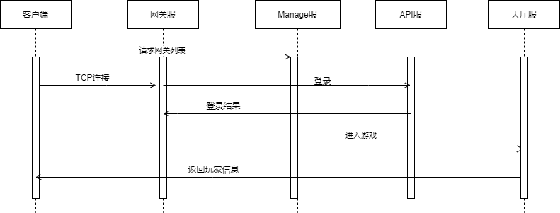
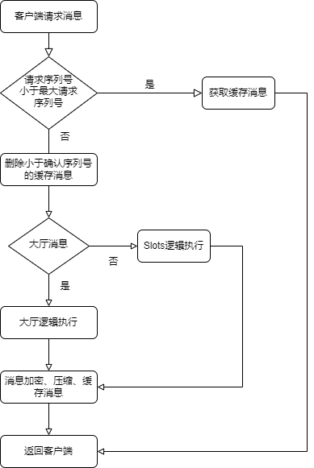

# 服务器架构
&emsp;&emsp;服务器采用微服务进行架构，客户端到网关使用自定义TCP进行网络通信（Netty+Protobuf），内部通信使用grpc，
后台管理系统调用查询使用HTTP协议。服务配置，服务发现使用zookeeper进行管理。整体架构如下所示：  


## API服
&emsp;&emsp;API可水平扩展，主要功能如下：
* 注册、登录校验
* 充值校验  

&emsp;&emsp;玩家首次打开游戏APP通过HTTP向Manage服获取网关列表；
客户端使用返回的地址向网关进行TCP连接；然后向Api服进行登录校验或用户注册；如果校验失败直接经网关返回客户端，否则将信息经网关再发送给大厅服请求加载玩家数据。
后续所有客户端请求TCP消息都通过网关服转发，时序图如下所示：  

  


## 网关服
&emsp;&emsp;网关服也是水平扩展的，连接API服、大厅服、Slots小游戏服，负责各自消息的转发，主要功能如下：
* 网络消息的转发
* 玩家连接会话管理
* 消息合并
* 数据加解密
* 数据压缩、解压缩
* 玩家通信频率限制，IP黑名单处理

&emsp;&emsp;玩家登录选择游戏服后，会在网关绑定玩家登录的游戏服连接会话，以后所有消息都转发到对应该游戏服。
 网络消息转发通过为每个消息定义一个消息ID进行转发。如果消息ID是注册在大厅服，就将相应的消息转发给大厅服。  
 
 &emsp;&emsp;消息合并是将游戏逻辑服同一时间同一玩家的多条返回消息合并成一个消息转发给客户端，减少网络延迟，丢包重发等。
 消息合并不超过MTU，且必须设置超时时间。数据加解密使用对称加密算法RC4，创建Socket时服务器返回一个密钥字符串。
 数据压缩使用Snappy进行压缩，且只对消息长度超过MTU的部分数据进行压缩。
 通信频率限制，IP黑名单主要是针对非法玩家使用加速器的请求，篡改协议等做出相应的限制。
 
 ### 协议定义
 &emsp;&emsp; 用户到网关，网关到大厅、Slots服使用自定义TCP协议进行通信，其他服务器互联使用标准的grpc连接。
 ####  用户到网关
  ```
  消息长度[4]+消息ID[4]+确认消息最小序列号[4]+消息序号[4]+Protobuf字节流
  ```
 &emsp;&emsp;用户到网关的协议其中消息长度第30位标识是否加密，29位标识是否压缩，后二十位表示真正的消息长度；
 消息序号用来确定每个消息的唯一性，客户端自增长，确认消息序列号是客户端收到的请求消息最小序列号；
 消息序号用于判断客户端重复请求，同一序号只能被后台服务器执行一次，网关会进行返回消息缓存，如果客户端请求消息序号网关有缓存，直接从缓存消息返回结果，比如断线重连；
 服务器收到确认消息最小序号就将网关缓存的所有小于改序号的缓存消息清除掉，表示客户端不再需要该消息。流程图如下所示：  
 
  


 #### 网关和内部进程
 ```shell script
 消息长度[4]+消息ID[4]+玩家ID[8]+消息序号[4]+Protobuf字节流
```
 &emsp;&emsp;网关到内部进程服务协议增加了玩家ID，需要知道每条消息归属于那个玩家。
## 大厅服
 &emsp;&emsp;大厅服是可水平扩展的有状态逻辑服务器，每个玩家登录都会在网关绑定一个大厅，同一玩家只能在同一大厅处理自身逻辑。
 大厅逻辑不会涉及玩家间的交互逻辑，如公会，聊天则会转发到世界服进行逻辑处理。
 核心功能模块参考[下一节](核心模块.md)，大厅主要功能模块有：
 * 任务、收集、宠物、成就等养成系统
 * 好友、邮件
 * 活动
 
## 世界服
&emsp;&emsp;世界服是单点有状态服务器，主要处理多个玩家有交互的逻辑，主要功能模块有：
* 公会
* 聊天

## Slots服
&emsp;&emsp;Slots服是各种slots小游戏，每个小游戏是单独的有状态微服务。
Slots服和网关采用自定义TCP协议通信，和大厅采用grpc通信。
slots服只编写游戏逻辑，公共处理逻辑调用大厅rpc。


## Manage服
&emsp;&emsp;Manage是无状态的HTTP服务，采用SpringBoot搭建的web框架。
可水平扩展，采用Nginx做负载均衡，内部采用grpc和所有服务进行通信。主要功能如下：
* 客户端获取网关IP地址
* 后台查询修改玩家信息入口
* 服务器管理入口（加载脚本、配置、关服等）

## 微服务
&emsp;&emsp;微服务主要采用Go语言开发，主机是解决Java进程占用内存较大问题，同时开发速度快。
微服务设计目的主要是为了分割世界服这种有状态的单点逻辑。

